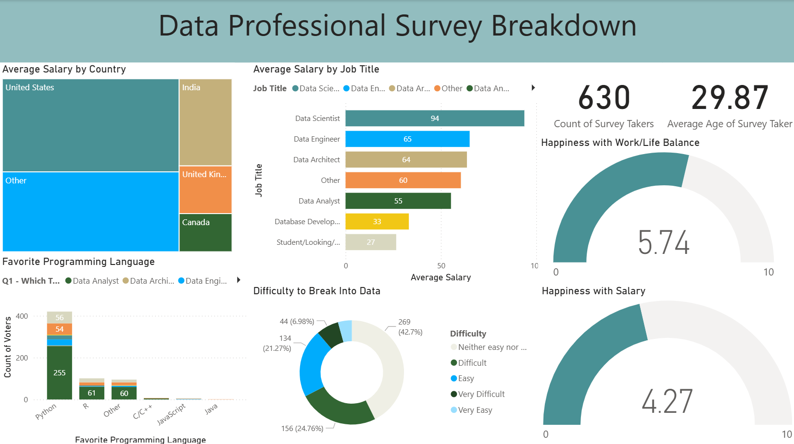

# 📊 Data Professional Survey Dashboard  

An interactive **Power BI dashboard** that visualizes insights from a survey of 630+ data professionals. This project analyzes **salaries, job titles, countries, work-life balance, and programming language preferences**, helping showcase trends in the data industry.  

---

## 🚀 Features  
- **Average Salary Analysis**  
  - By **Country** (US, India, UK, Canada, Others)  
  - By **Job Title** (Data Scientist, Data Engineer, Data Analyst, etc.)  

- **Career & Lifestyle Insights**  
  - Happiness with **Work/Life Balance**  
  - Happiness with **Salary**  

- **Programming Language Preferences**  
  - Popular languages (Python, R, SQL, C/C++, JavaScript, Java, etc.)  

- **Breaking into Data**  
  - Visual breakdown of perceived difficulty entering the field  

- **Interactive Visuals**  
  - Treemap, Gauges, Bar Charts, Pie Charts, and Donut Charts  
  - Drill-down and hover tooltips for deeper exploration  

---

## 🛠️ Tools & Technologies  
- **Power BI** – Dashboard design, data modeling, DAX measures, interactive visualizations  
- **SQL** – Data extraction, cleaning, and aggregation from raw survey responses  
- **Excel** – Preprocessing, pivot tables, and transformation before integration into Power BI  

---

  

---

## 🔑 Key Insights  
- **Data Scientists** have the highest average salary among surveyed roles.  
- **Python** is the most preferred programming language by a large margin.  
- Most professionals rated **work-life balance higher than salary satisfaction**.  
- Entering the data field is perceived as **challenging**, with the majority rating it "Difficult" or "Neither Easy nor Difficult."  

---

## 📈 Future Improvements  
- Automate data refresh using SQL database connection.  
- Add advanced DAX calculations for trend analysis.  
- Expand dashboard with **predictive insights** (e.g., salary forecasting).  

---
